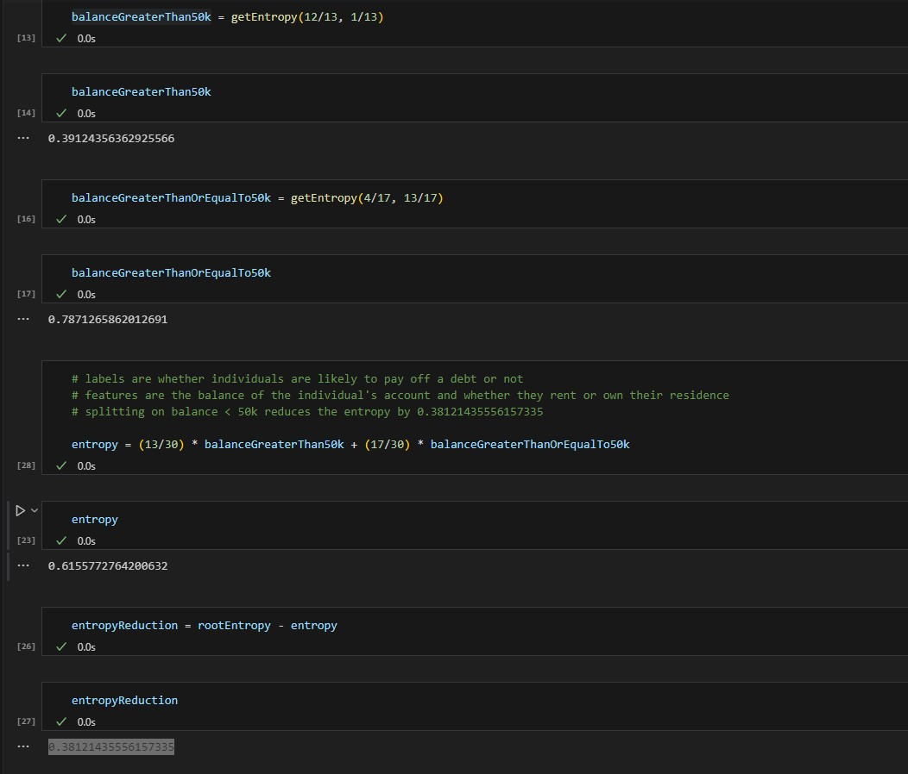

## May 25, 2023

Refactored some thoughts into a function that determines entropy for a root tree model that predicts whether an individual is likely to pay off a debt based on features: 
- Account balance
- Whether they rent or own their residence. 

